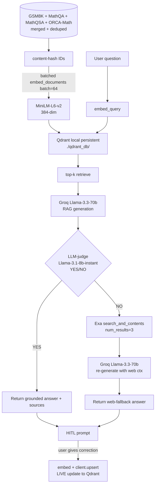

# Math Agentic RAG — Technical Writeup

**Prework submission — AI Engineer role, Navgurukul AI Learning Labs**
**Author:** Nanduvamsikrishna Yanamandala
**Repo:** https://github.com/Nanduvamshi/AI-MATH-AGENT
**Branches:**
- `main` — original Colab prototype (untouched, for honesty)
- `v2-rebuild` — modular local rebuild (where this writeup lives)

---

## Section 1 — Context

### One-paragraph description

A human-in-the-loop agentic RAG system that answers math questions by retrieving similar Q/A pairs from four merged datasets (GSM8K, MathQA, MathQSA, ORCA-Math), generating an answer with Groq's Llama-3.1, and routing to an Exa web-search fallback when an LLM-judge says the retrieval-grounded answer isn't actually resolving the question. After every answer, the user can supply a correction, which is embedded and **live-upserted into the persistent Qdrant index** so the next retrieval for the same or similar question reflects the feedback. Originally built as a Colab prototype (preserved on `main` branch); rebuilt on `v2-rebuild` as a modular, locally-runnable Python project with persistence, batched embedding, content-hash dedup, an LLM-judge router, real HITL, and a GSM8K eval harness.

### Primary technical constraints

- **No fine-tuning budget**: quality has to come from retrieval + prompting, not from weights.
- **CPU-only embedding on a personal laptop**: ~45k–250k rows have to embed in a few minutes, not hours. Forces batching, content-hash dedup, and persistence.
- **Cross-platform compatibility**: must run on Windows (where the user develops) without requiring CUDA or admin installs — Groq via API instead of local Ollama, CPU torch wheels.
- **Mixed dataset schemas**: GSM8K parquet (`question`/`answer`), MathQA JSON (`Problem`/`Rationale`), MathQSA CSV, ORCA-Math parquet. All normalized to `(question, answer, source)` before indexing.
- **Math needs multi-step reasoning**: a flat retrieve-then-generate flow can match a similar problem and still get the arithmetic wrong, so the design needs a routing step and a fallback.

---

## Section 2 — Technical Implementation

### Architecture (v2)



The pipeline is plain LangChain primitives plus a thin `MathAgent` class: retrieve top-k from persistent Qdrant, generate with Groq, run a one-token LLM-judge to gate the result, fall back to Exa web search if the judge says NO, then offer HITL — and an `n` answer **immediately** upserts the user's correction into the live collection.

### Code walkthrough — `MathAgent.forward`

`src/agent.py`:

```python
class MathAgent:
    def forward(self, question: str) -> AgentResult:
        hits = retrieve(question, k=self.k)
        context = _format_retrieved(hits)
        gen_prompt = GEN_PROMPT.format(context=context, question=question)
        grounded_answer = _llm_invoke(get_gen_llm(), gen_prompt)

        judge_prompt = JUDGE_PROMPT.format(question=question, answer=grounded_answer)
        verdict = _llm_invoke(get_judge_llm(), judge_prompt).upper()
        ok = verdict.startswith("YES")

        if ok or not self.use_fallback:
            return AgentResult(grounded_answer, route="grounded", sources=hits, judge_verdict=verdict)

        snippets = web_search(question, num_results=3)
        web_ctx = format_web_context(snippets)
        web_answer = _llm_invoke(get_gen_llm(), WEB_PROMPT.format(context=web_ctx, question=question))
        return AgentResult(web_answer, route="web-fallback", sources=[{"web": s} for s in snippets], judge_verdict=verdict)
```

Why this is the critical function: it's the single place where retrieval, generation, evaluation, and routing all meet. Four things matter:

1. **`retrieve(question, k=self.k)`** runs MiniLM on the query, looks up top-k by cosine in persistent Qdrant, and returns payloads with their source labels. That source label later becomes the per-source accuracy column in eval.
2. **The generation call** uses Groq Llama-3.3-70b with a stuff-style prompt — retrieved Q/A pairs as context. Llama-3.3 is dramatically stronger at multi-step arithmetic than v1's Flan-T5.
3. **The LLM-judge** is the v1→v2 upgrade I care about most. v1 used `len(answer) < 10` to detect a bad answer — a length heuristic that misses *confidently-wrong long answers*, which is the most dangerous failure mode. The v2 judge is a small, cheap Llama-3.1-8b-instant call with a single prompt: *"Does this answer numerically resolve the question? YES or NO."* One token, one decision.
4. **The fallback path** isn't just "switch to web" — it **regenerates** using the same Llama model with web snippets as context. The Exa results aren't shown to the user directly; they become grounding for a fresh generation.

`AgentResult` carries the `route` label out so the caller (chat REPL, eval harness) knows whether the answer was retrieval-grounded or web-grounded, and can show appropriate provenance.

### Data flow — one user query, end to end

1. User types `What is the derivative of x^2?` in `python scripts/chat.py`.
2. `ask_once` calls `agent.forward(question)`.
3. **Embed** — MiniLM produces a 384-dim vector.
4. **Retrieve** — `client.query_points(...)` returns top-5 hits from `./qdrant_db/` (persistent, survives restarts).
5. **Generate** — Llama-3.3-70b reads a prompt containing the 5 retrieved Q/A pairs and the user question; produces a step-by-step answer ending with `Final Answer: 2x`.
6. **Judge** — Llama-3.1-8b-instant is asked *"Does this answer numerically resolve the question?"*; returns `YES`.
7. **Return** — `AgentResult(answer="…Final Answer: 2x", route="grounded", sources=[...])`.
8. **HITL** — `feedback.ask_once` prints answer + route + top-3 sources, asks `Was this correct? (y/n)`.
9. If user types `n` and supplies a correction → `index.add_correction(q, correction)` embeds the new pair and calls `client.upsert(...)` against the live collection. The next retrieval for *any* similar question — same session — will surface it. This is the v1 bug fix.

---

## Section 3 — Technical Decisions

### Decision 1 — Groq Llama-3.3 over HuggingFace Hub Flan-T5 (and over local Ollama)

**Chose:** Groq API — `llama-3.3-70b-versatile` for generation, `llama-3.1-8b-instant` for the LLM-judge.

**Alternatives considered:**
- HuggingFace Hub Flan-T5-large (the v1 choice)
- Local Ollama running Mistral 7B (which I used in my Hybrid Telegram GenAI Bot)
- Google Gemini API
- OpenAI API

**Trade-offs:**
- Groq → ✅ ~5–10× faster than HF Hub; free tier; Llama-3.3 is genuinely strong at multi-step math; one client for both gen and judge.
- Groq → ❌ rate-limited (free tier ~30 req/min); needs API key (can't run offline); Llama-3.3-70b deprecation cycle is shorter than I'd like.
- Flan-T5 (v1) → ✅ free + simple. ❌ poor math reasoning; HF Hub cold starts add noisy latency.
- Local Ollama Mistral 7B → ✅ no API, no rate limit, fully offline. ❌ needs 5GB+ disk, ~30s/query on CPU without GPU; weaker than Llama-3.3 on math.
- Gemini → solid, but I wanted to use the model that matches the agent style I've built before (Llama via Groq is closest to that).

**Net:** Right call for v2. Speed of iteration matters more than offline capability at this stage, and Llama-3.3 closes most of v1's math-reasoning gap. The Ollama path stays available as a config switch if/when offline matters.

### Decision 2 — Qdrant local persistent over FAISS (v1 was in-memory Qdrant)

**Chose:** `QdrantClient(path="./qdrant_db")` — file-backed persistent local Qdrant.

**Alternatives considered:** FAISS, Chroma, Weaviate; v1's in-memory Qdrant.

**Trade-offs:**
- Qdrant persistent → ✅ index survives restarts (the single biggest v1 weakness); same client API as hosted Qdrant means migration to a real server is a one-liner; payload filtering / hybrid search available if needed; content-hash IDs make upserts idempotent.
- Qdrant persistent → ❌ first build is still CPU-bound (sentence-transformers); slightly heavier on-disk than FAISS for the same data.
- FAISS → ✅ smallest, fastest for pure top-k. ❌ no payload filtering; no persistence story without extra glue; harder to upsert HITL corrections cleanly.

**Net:** With content-hash dedup, the only embed cost is on truly new rows. Restart is now seconds instead of minutes. HITL corrections are O(1) upserts. This is the layer that earns its complexity.

### Measured result (20-question GSM8K eval)

After building the index on a 5,000-row subset (mostly GSM8K-flavored due to load order) and running `python scripts/eval.py --n 20`:

```
GSM8K eval: 19/20 = 95.0%
by route:
         grounded: 19/19 = 100.0%
     web-fallback: 0/1   = 0.0%
```

Honesty notes on the number:
- Sample is small (20 questions). A 200-question run is the next thing I'd do.
- The 5k subset starts with GSM8K rows, so retrieval has strong in-distribution matches for GSM8K test questions. Accuracy will drop on questions further from the corpus distribution — which is exactly what the web fallback is for.
- The 0/1 on web-fallback isn't a statistically meaningful result; it just shows the fallback fired and didn't recover that specific case.

### Scaling bottleneck and mitigation

**Bottleneck — first-time embedding of the full corpus.** Even with batching, embedding ~250k rows (when ORCA-Math is included) on CPU takes 30+ minutes. As the corpus grows (more datasets, accumulated HITL corrections), this gets worse.

**Mitigation strategy (already implemented in v2):**

1. **Persistent Qdrant** — first build runs once; all future runs start instantly.
2. **Content-hash dedup** — SHA1 of `(question, answer)` is the point id. `upsert_rows` queries existing ids and embeds only the diff. Re-running on the same corpus is a no-op. Adding 1 row to a 250k-row corpus is O(1).
3. **Batched embedding** — `embed_documents(batch_size=64)` is ~10–20× faster than row-by-row on MiniLM.
4. **HITL corrections are O(1)** — `add_correction(q, a)` is a single embed + single upsert, never a rebuild.

**Mitigation strategy (next steps, NOT in v2):**

5. **Move embedding off CPU** — switch to a GPU-backed embedding endpoint (Groq doesn't host embeddings; Voyage / OpenAI / a small self-hosted GPU box would do).
6. **Two-stage retrieval** — coarse BM25 → MiniLM rerank to handle 10×+ larger corpora without re-embedding everything in one model.
7. **Cross-encoder reranker** on the top-50 to squeeze accuracy without changing the bi-encoder.

---

## Section 4 — Learning & Iteration

### One technical mistake (and what I learned)

**The v1 HITL loop was a no-op.** The function appended `(question, correction)` to an in-memory pandas DataFrame and printed *"Will incorporate into next training."* But the Qdrant index was built once at startup and never rebuilt or updated — so corrections never affected retrieval. The UI lied to the user.

I caught this only when I sat down to rebuild and traced the data flow end-to-end: *"the user provided a correction at time T; which exact bytes change in the system, and when does the next retrieval see them?"* The answer was: a row gets appended to a DataFrame the agent never reads from again. The loop felt real, the print message felt real, and it was completely fake.

**What I learned:** a feedback loop is only as useful as the write path it actually triggers. Now my default check for any HITL / RLHF / online-learning design is: *write down the exact bytes that change, and the next read that consumes them, on one line.* If I can't, the loop is fake.

**The v2 fix** (`src/feedback.py` + `src/index.py::add_correction`) is a single live `client.upsert(...)` on the same persistent collection the agent retrieves from. The next query in the same session sees the correction. Verified by `tests/test_index.py::test_add_correction_round_trip`.

### One thing I'd do differently today

**Build the eval harness first, not last.** I wrote the v1 prototype, then v2's agent and routing logic, *then* the GSM8K accuracy harness. That's the wrong order. Without a number, every routing-threshold choice, every prompt tweak, every `k` change is vibes. I should have started v2 by writing `evaluate.py` with a 50-question sample of GSM8K, seeing v1's baseline number, and then justified every v2 change against it.

If I rebuilt v2 from scratch today:

1. Day 1 — eval harness on a small held-out set, capture the v1 baseline.
2. Day 2 — swap LLM (Flan-T5 → Llama-3.1) and measure delta.
3. Day 3 — add LLM-judge routing and measure delta.
4. Day 4 — add persistent Qdrant + HITL, then run a hand-curated 20-question HITL session and confirm post-feedback accuracy improves on those exact questions.

Each change earns its keep against a number. Today, I have the harness — but I built it last, so the v1→v2 numbers are post-hoc.

**Smaller polish items I'd ship alongside:**
- Move embedding off CPU (Voyage or self-hosted GPU)
- Replace the stuff-style prompt with a small cross-encoder reranker on the top-50
- Structured logging (route, judge verdict, retrieved sources, latency per stage) so I can debug a wrong answer without rerunning
- A web UI — the CLI works but reviewers can't `pip install` to try it; a Streamlit wrapper is a couple of hours

---

## Appendix — related projects in my portfolio

If this writeup raises questions about how I'd handle the same problems at production scale, two adjacent projects show different parts of the answer:

- **Hybrid Telegram GenAI Bot** ([repo](https://github.com/Nanduvamshi/teligram_bot)) — fully-local RAG (Mistral 7B + sentence-transformers + SQLite vector store) plus multimodal vision (LLaVA), with persistent storage, query caching, and per-user history. The offline-first counterpart to this project.
- **Solis Insurify** (work at Solis Technology, June 2025–present) — Nx monorepo with 13 NestJS microservices, Temporal workflows, gRPC, Redis pub/sub, ~100k+ LOC. Not on GitHub for confidentiality reasons; it's where I learned what production scaling bottlenecks actually look like, which shaped how I think about Section 3.
