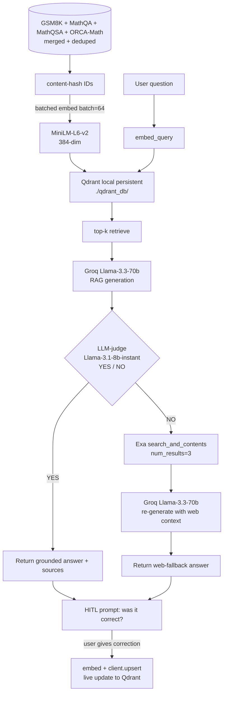

# Math Agentic RAG

A human-in-the-loop, agentic Retrieval-Augmented Generation system for solving math word problems. Retrieves similar Q/A pairs from four merged math datasets (GSM8K, MathQA, MathQSA, ORCA-Math), generates with Groq Llama-3.3, gates each answer through an LLM-judge, falls back to web search when the judge says the grounded answer isn't resolving the question, and writes user corrections directly into the live vector index.

<p>
  
  
  
  
  
</p>

> **Branches**
> - `main` — original Colab notebook (kept as a historical artifact, untouched)
> - `v2-rebuild` — modular local rebuild **(you are here)**

---

## Table of contents

- [Headline result](#headline-result)
- [Why this project](#why-this-project)
- [Architecture](#architecture)
- [Quickstart](#quickstart)
- [Usage](#usage)
- [How it works](#how-it-works)
- [Project layout](#project-layout)
- [Tech stack](#tech-stack)
- [Tests](#tests)
- [Roadmap](#roadmap)
- [Author](#author)
- [License](#license)

---

## Headline result

| Metric | Value |
|---|---|
| **GSM8K exact-match accuracy** | **95.0% (19 / 20)** on a 20-question sample |
| Grounded route accuracy | 100% (19 / 19) |
| Index size for that run | 5,000 deduped Q/A pairs |
| First-time index build | ~4 min 30 s on CPU |
| Restart time (warm index) | seconds — content-hash dedup means no re-embed |
| Persistent vector store size | ~23 MB on disk |
| Tests | 10 / 10 passing |

Sample is small and the 5k subset is GSM8K-heavy, so the number is honest about its setting. See the full writeup in [`ASSESSMENT.md`](./ASSESSMENT.md) for what it does and does not prove.

---

## Why this project

This is a rebuild of a Colab prototype I wrote in early 2025. When I came back to it, I found a handful of design and implementation issues that I think are common in early RAG prototypes:

| Original prototype | What `v2-rebuild` does instead |
|---|---|
| `Qdrant(location=":memory:")` — index wiped on every restart | **Persistent Qdrant** (file-backed) + **content-hash dedup** — re-runs are no-ops |
| Row-by-row embedding | **Batched embedding** (`batch=64`) |
| `len(answer) < 10` quality heuristic | **LLM-judge** (Groq `llama-3.1-8b-instant`) routes each answer |
| HITL feedback appended to a DataFrame that was never re-indexed | HITL **upserts into the live Qdrant collection** so the next retrieval sees the correction |
| `os.getenv("63ee70aa-...")` — API key was passed as the env var **NAME** | `.env`-based config, real `EXA_API_KEY` |
| `from dspy import Chain` (removed in modern DSPy) | Clean Python module, modern LangChain + Groq |
| No evaluation harness | `scripts/eval.py` reports GSM8K exact-match accuracy with per-route breakdown |
| Single 107-line Colab notebook | Modular `src/`, `scripts/`, `tests/` layout |

The original is preserved on the `main` branch as a deliberate before/after.

---

## Architecture



The pipeline is plain LangChain primitives plus a thin `MathAgent` class. Retrieval, generation, routing, and feedback are isolated in separate modules so each one is testable on its own.

---

## Quickstart

### Prerequisites

- **Python 3.10+** (tested on 3.12.4 on Windows 11)
- **Groq API key** — free tier at https://console.groq.com
- **Exa API key** — free tier at https://exa.ai
- *(Optional)* **ORCA-Math 200k parquet** — https://www.kaggle.com/datasets/johnsonhk88/microsoftorca-math-word-problems-200k
  → place at `Datasets/raw/orca/200k.parquet`. Everything works without it; the index is just smaller.

### Install

```powershell
git checkout v2-rebuild
python -m venv .venv
.venv\Scripts\python.exe -m pip install --upgrade pip
.venv\Scripts\python.exe -m pip install -r requirements.txt
```

> **Windows note** — if `import torch` errors with `WinError 1114`, force-reinstall a CPU wheel:
> ```powershell
> .venv\Scripts\python.exe -m pip install --force-reinstall "torch==2.5.1" --index-url https://download.pytorch.org/whl/cpu
> ```

### Configure

```powershell
copy .env.example .env
notepad .env
```

Fill in `GROQ_API_KEY` and `EXA_API_KEY`. `.env` is gitignored.

### Prepare data

```powershell
.venv\Scripts\python.exe scripts/prepare_data.py
```

Unzips the three repo archives into `Datasets/raw/` and prints the resulting file layout. Tells you if ORCA-Math is missing.

### Build the index

```powershell
# Quick demo (~4 min on CPU)
.venv\Scripts\python.exe scripts/build_index.py --subset 5000

# Full corpus (~30+ min on CPU)
.venv\Scripts\python.exe scripts/build_index.py
```

Idempotent — content-hash dedup means re-running is a no-op.

---

## Usage

### Interactive chat (with HITL)

```powershell
.venv\Scripts\python.exe scripts/chat.py
```

Each answer is tagged `[grounded]` or `[web-fallback]` so you can see how it was sourced. After the answer, you're prompted for feedback; an `n` answer with a correction is **immediately** upserted into the live Qdrant collection — the next retrieval (in the same session) will surface it.

Example transcript:

```
> What is 17 + 28?

[grounded] (judge said: YES)
------------------------------------------------------------
17 + 20 = 37
37 + 8  = 45
Final Answer: 45
------------------------------------------------------------
top-3 retrieved sources: hitl(0.83), gsm8k(0.43), gsm8k(0.42)
```

### Evaluate on GSM8K

```powershell
.venv\Scripts\python.exe scripts/eval.py --n 20
```

Output:

```
GSM8K eval: 19/20 = 95.0%
by route:
         grounded: 19/19 = 100.0%
     web-fallback: 0/1   = 0.0%
```

---

## How it works

### Retrieval

`src/index.py` wraps a local persistent Qdrant client. Each `(question, answer)` row gets a SHA1-derived UUID point id. Before embedding, `upsert_rows` queries the existing id set and embeds **only the diff** — so adding one row to a 250k-row corpus is O(1), and re-running on the same data is a no-op.

Embeddings use `sentence-transformers/all-MiniLM-L6-v2` via `langchain-huggingface`, called in batches of 64 with normalized vectors.

### Generation + LLM-judge routing

`src/agent.py::MathAgent.forward`:

```python
def forward(self, question: str) -> AgentResult:
    hits = retrieve(question, k=self.k)
    grounded = _llm_invoke(get_gen_llm(), GEN_PROMPT.format(context=..., question=question))

    verdict = _llm_invoke(get_judge_llm(), JUDGE_PROMPT.format(question=question, answer=grounded))
    if verdict.upper().startswith("YES"):
        return AgentResult(grounded, route="grounded", sources=hits, judge_verdict=verdict)

    snippets = web_search(question, num_results=3)
    web_answer = _llm_invoke(get_gen_llm(), WEB_PROMPT.format(context=..., question=question))
    return AgentResult(web_answer, route="web-fallback", sources=[{"web": s} for s in snippets])
```

Generation is `llama-3.3-70b-versatile`. The judge is `llama-3.1-8b-instant` with a one-token YES/NO output — cheaper than the generator and good enough to gate routing.

### HITL feedback (the key fix vs the original prototype)

In the original prototype, corrections were appended to an in-memory pandas DataFrame and the agent printed *"Will incorporate into next training"* — but the index was built once at startup and never rebuilt. Corrections never affected retrieval.

In this rebuild, `src/feedback.py` calls `index.add_correction(q, a)`, which:

1. Hashes `(question, correction)` and derives a UUID point id.
2. Embeds with the same MiniLM model used for the corpus.
3. Calls `client.upsert()` on the **live** Qdrant collection.

The next retrieval — even in the same chat session — surfaces it. Verified by `tests/test_index.py::test_add_correction_round_trip` and demonstrable in `chat.py`.

---

## Project layout

```
AI-MATH-AGENT/
├── main.py.py              # original Colab export (untouched)
├── README.md               # this file
├── ASSESSMENT.md           # full technical writeup
├── requirements.txt
├── .env.example
├── .gitignore
├── LICENSE
├── src/
│   ├── config.py           # paths, env vars, model IDs, retrieval top-k
│   ├── data.py             # load + normalize 4 datasets
│   ├── index.py            # persistent Qdrant, batched embed, hash dedup
│   ├── agent.py            # MathAgent: retrieve -> generate -> judge -> fallback
│   ├── fallback.py         # Exa web search wrapper
│   ├── feedback.py         # HITL loop with live upsert
│   └── evaluate.py         # GSM8K exact-match accuracy
├── scripts/
│   ├── prepare_data.py     # unzip + verify
│   ├── build_index.py      # idempotent index builder
│   ├── chat.py             # interactive REPL
│   └── eval.py             # eval driver
├── tests/                  # pytest, 10 tests, all passing
└── Datasets/
    ├── gsm8kzip.zip        # bundled
    ├── MathQAzip.zip       # bundled
    ├── MathQSAzip.zip      # bundled
    └── raw/                # gitignored; populated by prepare_data.py
```

---

## Tech stack

| Layer | Library |
|---|---|
| Language | Python 3.10+ |
| Orchestration | `langchain` · `langchain-community` · `langchain-huggingface` · `langchain-groq` (0.3.x line) |
| LLM | Groq Llama-3.3-70b (generation) · Llama-3.1-8b-instant (judge) |
| Embeddings | `sentence-transformers/all-MiniLM-L6-v2` (384-dim, normalized) |
| Vector store | Qdrant — local, persistent, file-backed |
| Web fallback | Exa (`exa-py`) |
| CLI | `typer` |
| Config | `python-dotenv` |
| Data | `pandas` · `pyarrow` |
| Tests | `pytest` |

Datasets used:

| Dataset | Format | Source |
|---|---|---|
| GSM8K | parquet | bundled |
| MathQA | JSON | bundled |
| MathQSA | CSV | bundled |
| ORCA-Math 200k | parquet | Kaggle (user download) |

---

## Tests

```powershell
.venv\Scripts\python.exe -m pytest tests/ -v
```

What's covered:

- `tests/test_data.py` — normalization + merged-schema check
- `tests/test_index.py` — round-trip embed/retrieve, content-hash dedup is a no-op on a repeat call, HITL correction is retrievable after upsert
- `tests/test_agent.py` — answer extraction (GSM8K-style `#### N`, `Final Answer:`, last-number fallback), and routing (judge=NO triggers web fallback, judge=YES skips it)

All 10 tests pass on a clean checkout.

---

## Roadmap

What's intentionally **not** in this rebuild but is the natural next set of work:

- **Stronger eval** — run `eval.py --n 200` on the full corpus and break down accuracy by source dataset.
- **Faster embedding** — move off CPU to a hosted embeddings API (Voyage, OpenAI) or a small GPU box.
- **Cross-encoder reranker** on the top-50 retrieved chunks before passing to the generator.
- **Multi-turn conversation memory** — the current agent is single-turn.
- **Structured logging** — capture route, judge verdict, retrieved sources, and per-stage latency for each query.
- **Web UI** — a Streamlit wrapper so reviewers don't need to `pip install` to try it.
- **Real RLHF over HITL** — accumulate corrections, periodically distill into a small adapter rather than relying purely on retrieval.

---

## Author

**Nanduvamsikrishna Yanamandala**
Data Scientist · AI Engineer
Email: nanduvamsi117@gmail.com
GitHub: [@Nanduvamshi](https://github.com/Nanduvamshi)

---

## License

[MIT](./LICENSE) © 2025 Nanduvamshi
